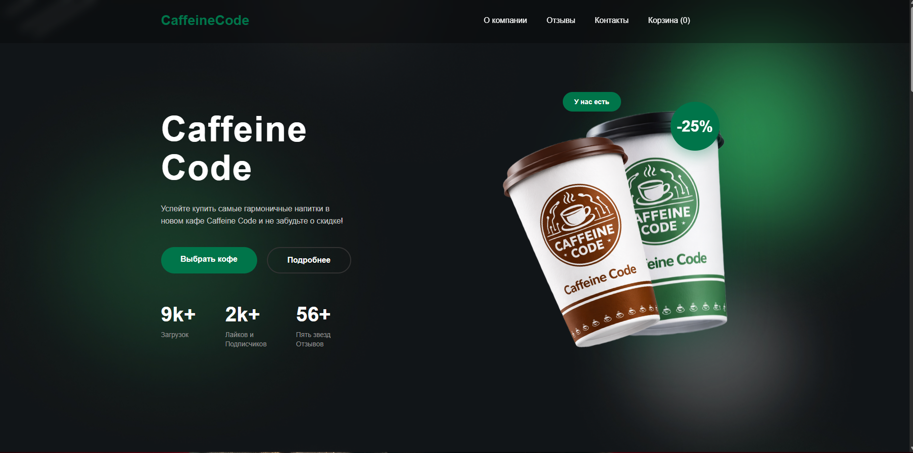
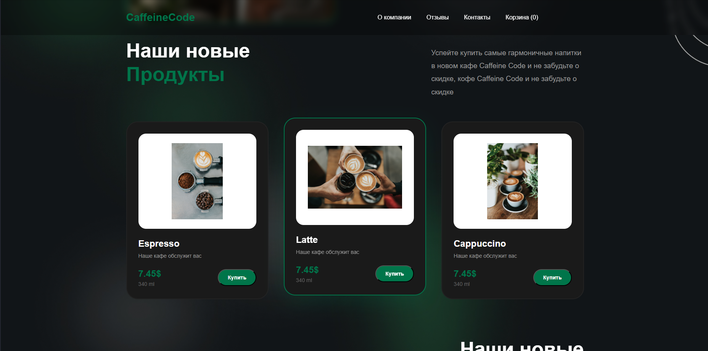
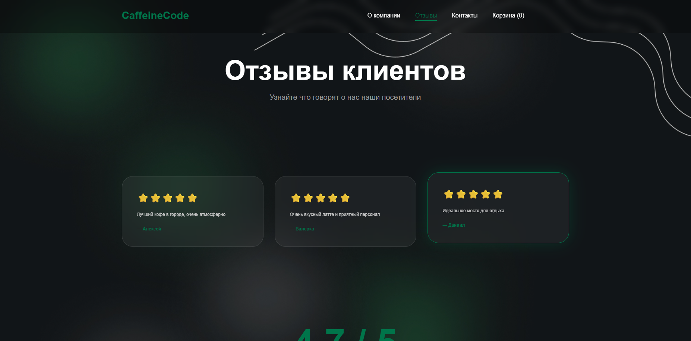
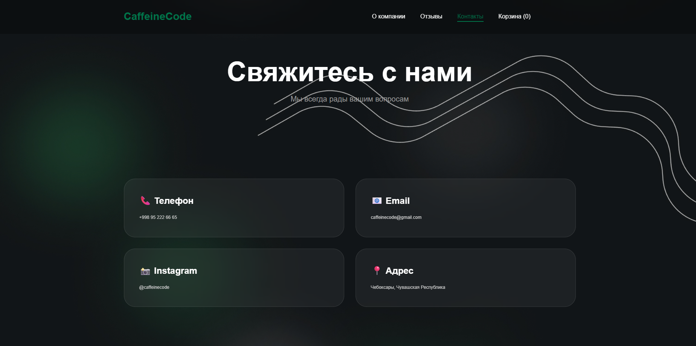
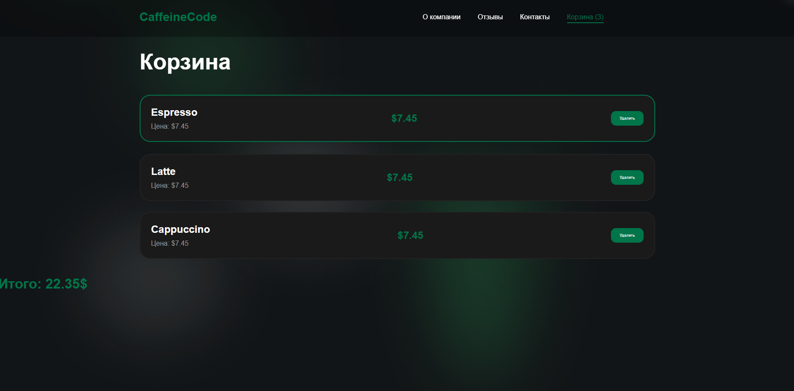

# ☕ Caffeine Code

Современный веб-сайт кофейни, разработанный с использованием React. Проект демонстрирует навыки работы с компонентным подходом, маршрутизацией, адаптивной версткой и управлением состоянием.

---

## 🚀 Возможности

✅ Многостраничное приложение на React Router

✅ Современный адаптивный дизайн

✅ Навигационная панель с активными ссылками

✅ Страница "О компании"

✅ Страница отзывов

✅ Страница контактов

✅ Корзина товаров

✅ Добавление товаров в корзину

✅ Удаление товаров из корзины

✅ Подсчет количества товаров

✅ Подсчет общей стоимости заказа

✅ CSS Modules для изоляции стилей

---

## 🛠️ Технологии


---

## 📸 Скриншоты

### 🏠 Главная страница



---

### ☕ Меню напитков



---

### ⭐ Отзывы



---

### 📞 Контакты



---

### 🛒 Корзина



---

## 📂 Структура проекта

```bash
src
│
├── componet
│   ├── Navbar
│   ├── MiniFooter
│   ├── 1HeroSection
│   ├── 2FeaturesSection
│   ├── 3AboutSection
│   ├── 4ProductsSection
│   ├── 5EventsSection
│   ├── 6ContactsSection
│   └── 7FooterSection
│
├── pages
│   ├── Home.jsx
│   ├── About.jsx
│   ├── Reviews.jsx
│   ├── Contacts.jsx
│   └── Cart.jsx
│
├── image
│
├── App.jsx
└── App.css
```


## 🎯 Цель проекта

Проект был создан для практики современных технологий Frontend-разработки и демонстрации навыков работы с React, маршрутизацией, компонентной архитектурой и адаптивным дизайном.

---

## 👨‍💻 Автор

### Аббосбек Алламберганов

📧 Email:
abbosallamberganov57@gmail.com

📱 Телефон:
+998 95 222-66-65

💻 GitHub:
https://github.com/abbosallamberganov57-wq

---

## 📈 Планы по развитию

- [ ] Сохранение корзины через LocalStorage
- [ ] Увеличение и уменьшение количества товаров
- [ ] Поиск по меню
- [ ] Фильтрация напитков
- [ ] Форма отправки отзывов
- [ ] Онлайн оформление заказа
- [ ] Анимации интерфейса
- [ ] Темная и светлая тема

---